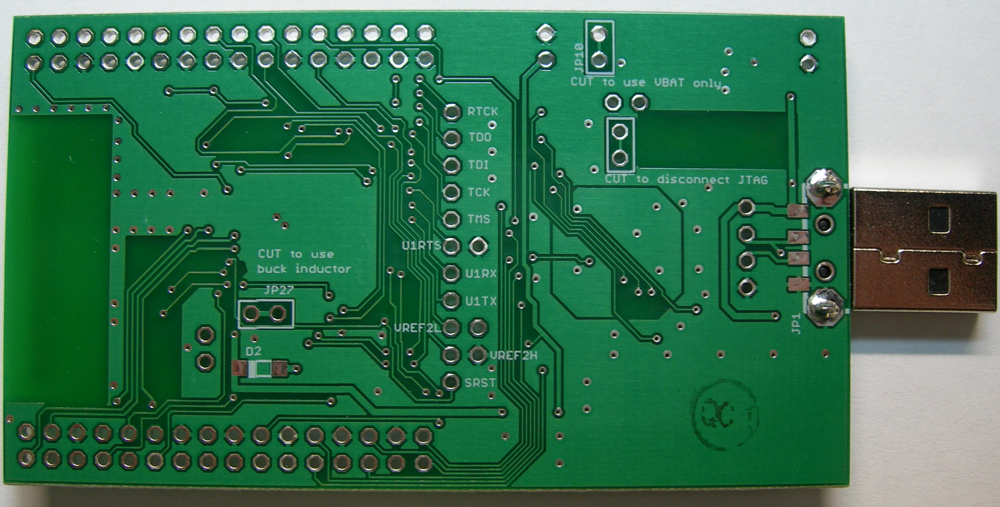
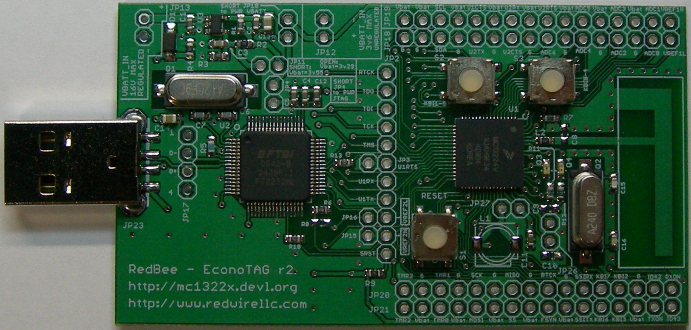

# Econotag #

### Redwire Econotag - mc13224v dev. board ###

MC13224 ARM7 802.15.4 SoC dev. kit with on-board JTAG

The perfect development and project board for the Freescale MC13224v ARM7 microcontroller and 802.15.4 radio. An onboard FT2232 provides access to the JTAG interface, and UART1. The board is powered over USB.
Debug with OpenOCD and GDB.

On board ROM bootloader for flashing.

no other programming hardware is necessary!

Board can be externally powered up to 16V for easy integration into prototypes or use with batteries in low power applications.
Features:

* Freescale MC13224v ARM7 microcontroller with 802.15.4 radio
* Integrated bootloader (UART1, SPI, or I2C)
* PCB Antenna (open-air LOS range approx. 500ft @ 0dDm; full transmit power is 4.5dBm.)
* 24MHz crystal
* Reset button
* Two general purpose push buttons
* 2 LEDs for general purpose or for RX and TX.
* Flash erase jumpers (can also be erased using JTAG)
* 36 GPIO brought out to 0.1" pin header (includes all peripheral pins)
* On-board FT2232H JTAG and UART
* USB-A connector, powered from USB
* Pads for optional inductor for integrated buck converter
* Pads for optional 32.768kHz crystal
* Open development environment available at http://mc1322x.devl.org
* Open hardware design (CC-BY-SA): design files

This work is licensed under a Creative Commons Attribution-Share Alike 3.0 Unported License.

Use of this design should be attributed to: Redwire, LLC.

Shipment from Redwire available worldwide.

**Open Source**
 [Open Source Hardware Definition v1.0](http://www.inmojo.com/licenses/#oshw_v1.0)

 **Hardware**
 [Creative Commons - Attribution - ShareAlike 3.0](http://www.inmojo.com/licenses/#cc_a_sa_3.0)

 **Docs & Files**
 [Creative Commons - Attribution - ShareAlike 3.0](http://www.inmojo.com/licenses/#cc_a_sa_3.0)
 
 **Software**
 [Simplified BSD License](http://www.inmojo.com/licenses/#simpbsd)

***
